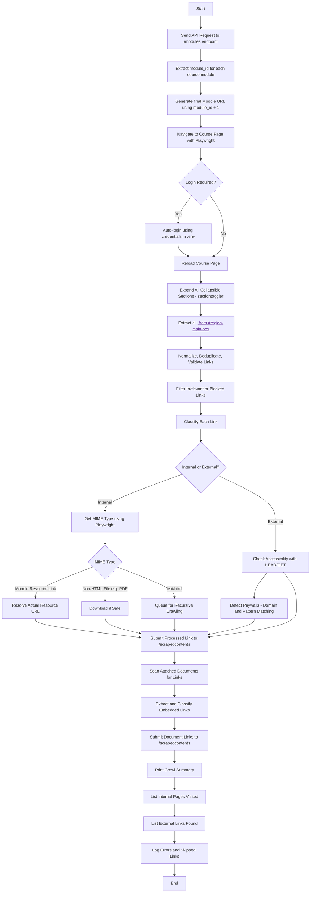

# LMSFinal
## 🔄 System Workflow

```mermaid
graph TD
    A[Start] --> B[Send API Request to /modules endpoint]
    B --> C[Extract module_id for each course module]
    C --> D[Generate final Moodle URL using module_id + 1]
    D --> E[Navigate to Course Page with Playwright]
    E --> F{Login Required?}
    F -->|Yes| G[Auto-login using credentials in .env]
    G --> H[Reload Course Page]
    F -->|No| H
    H --> I[Expand All Collapsible Sections - sectiontoggler]
    I --> J[Extract all <a href> from #region-main-box]
    J --> K[Normalize, Deduplicate, Validate Links]
    K --> L[Filter Irrelevant or Blocked Links]
    
    L --> M[Classify Each Link]
    M --> N{Internal or External?}
    
    N -->|Internal| O[Get MIME Type using Playwright]
    O --> P{MIME Type}
    P -->|text/html| Q[Queue for Recursive Crawling]
    P -->|Non-HTML File e.g. PDF| R[Download if Safe]
    P -->|Moodle Resource Link| S[Resolve Actual Resource URL]

    N -->|External| T[Check Accessibility with HEAD/GET]
    T --> U[Detect Paywalls - Domain and Pattern Matching]

    S --> V[Submit Processed Link to /scrapedcontents]
    R --> V
    Q --> V
    U --> V
    T --> V

    V --> W[Scan Attached Documents for Links]
    W --> X[Extract and Classify Embedded Links]
    X --> Y[Submit Document Links to /scrapedcontents]

    Y --> Z[Print Crawl Summary]
    Z --> ZA[List Internal Pages Visited]
    ZA --> ZB[List External Links Found]
    ZB --> ZC[Log Errors and Skipped Links]
    ZC --> ZD[End]

```
